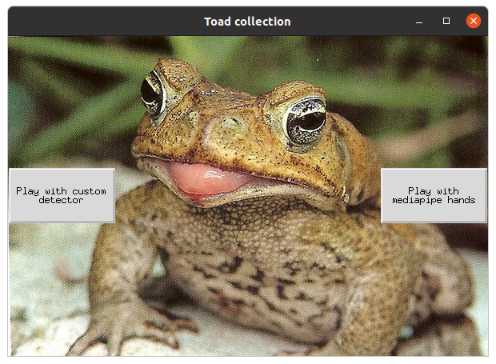

# ToadCollection

## How to play
- Install requirements
- Setup your camera in config/congig.py
- Load custom hand detector and place it into models/ ([Link](https://drive.google.com/file/d/1haPwEW3gOe0EP_mKT2lGAe09sUvpbgUC/view?usp=sharing))

## Detectors
- Custom detector (trained with Detectron2 framework, PyTorch). [Colab notebook with training](https://colab.research.google.com/drive/15qtcSWtzulIz2ghbpqX-wKo9bea9CcRK?usp=sharing)
- Mediapipe [Hands](https://google.github.io/mediapipe/solutions/hands.html)

### My system configuration
|   |         | 
| ------------- |:-------------:|
| CPU     |  Intel(R) Core(TM) i3-9100F CPU @ 3.60GHz |
| GPU | GeForce GT 1030      |
| Cuda version | 10.1 |
| OS | Ubuntu 20.04|
